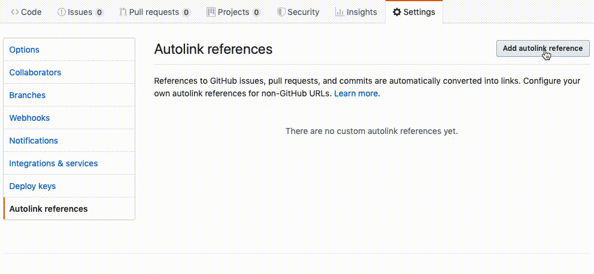

# git-tag

Automatically add ticket prefixes (JIRA-123, NFOR-456, etc.) to git commits on your current branch.

> **Note:** Ticket numbers can appear anywhere in your commit message. Examples:
> - `JIRA-123 Add feature` ✅
> - `Add feature JIRA-123` ✅
> - `RELEASE_0.3.1 JIRA-123 some message` ✅

## Features

- 🎯 **Auto-detect ticket** from branch name
- ✏️ **Manual ticket** specification with `--ticket`
- 🔧 **Custom prefixes** with `--prefix`
- 🛡️ **Commit enforcement** via git hook
- ⚙️ **Configurable format** in `src/config.ts`
- 🔒 **Safety protections**:
  - Automatically skips merge commits
  - Warns if branch has been pushed to remote
  - Cleans up git filter-branch backup refs
  - Requires `--force` flag for pushed branches

## Demo


> **Recording**: Shows the complete workflow from unprefixed commits to prefixed commits

## Why Ticket Prefixes Matter: Autolink References

One of the biggest benefits of consistently adding ticket prefixes with git-tag is taking advantage of **GitHub's autolink references**.

Autolink references automatically convert text patterns in your commits and PRs into clickable links. For example:
- `JIRA-123` → Links directly to your Jira ticket
- `NFOR-456` → Links to your project management tool
- Any custom pattern you define in repository settings

When you use git-tag to add proper ticket references to all your commits, GitHub will automatically link them throughout your commit history and PRs, making it easy to trace changes back to requirements and discussions.



**Learn more:** [Configuring autolinks to reference external resources](https://docs.github.com/en/repositories/managing-your-repositorys-settings-and-features/managing-repository-settings/configuring-autolinks-to-reference-external-resources)

## Installation

```bash
npm install
npm run build
npm link  # Install globally as 'git-tag' command
```

## Usage

### Auto-detect from branch name

```bash
# On branch: feat/JIRA-123-add-feature
git-tag

# Detects JIRA-123 and adds to all commits
```

### Manual ticket number

```bash
git-tag --ticket=JIRA-123
```

### Custom prefix

```bash
git-tag --prefix=RELEASE_V2
```

### Replace existing prefixes

```bash
# Fix incorrect ticket numbers
git-tag --ticket=JIRA-124 --replace

# Before: TOOL-123 fix bug in validation
# After:  JIRA-124 fix bug in validation
```

### Dry run

```bash
git-tag --dry-run
# Shows what would change without modifying commits
```

## Git Hooks

### 1. commit-msg (Smart Enforcement)

Enforces ticket prefixes only when your branch name contains a ticket number:

```bash
cp ~/Utils/git-tag/hooks/commit-msg .git/hooks/
chmod +x .git/hooks/commit-msg

# On branch feat/JIRA-123-add-feature (has ticket)
git commit -m "Add feature"           # ❌ Rejected - branch has ticket
git commit -m "JIRA-123 Add feature"  # ✅ Accepted

# On branch main or develop (no ticket)
git commit -m "Add feature"           # ⚠️  Warning but allowed

# Bypass check entirely:
git commit -m "Add feature" --no-verify
```

### 2. pre-push (Smart Warning)

Warns about unprefixed commits only when pushing a branch with a ticket number:

```bash
cp ~/Utils/git-tag/hooks/pre-push .git/hooks/
chmod +x .git/hooks/pre-push

# On branch feat/JIRA-123-add-feature (has ticket)
git push  # ⚠️ Warns if commits lack prefixes

# On branch main or develop (no ticket)
git push  # No warning - passes through

# Fix warnings:
git-tag --ticket=JIRA-123

# Or bypass check:
git push --no-verify
```

### 3. prepare-commit-msg (Auto-Add Prefix)

Automatically adds ticket prefix from branch name:

```bash
cp ~/Utils/git-tag/hooks/prepare-commit-msg .git/hooks/
chmod +x .git/hooks/prepare-commit-msg

# On branch feat/JIRA-123-new-feature
git commit -m "Add feature"
# Becomes: "JIRA-123 Add feature" automatically!
```

### Install All Hooks

```bash
# Install all three hooks at once
cp ~/Utils/git-tag/hooks/* .git/hooks/
chmod +x .git/hooks/commit-msg .git/hooks/pre-push .git/hooks/prepare-commit-msg
```

## Configuration

Edit `src/config.ts` to customize:

```typescript
export const DEFAULT_CONFIG = {
  // Ticket pattern (matches anywhere in commit message)
  ticketPattern: /[A-Z]{2,10}-\d{2,10}/,

  // Message format
  messageFormat: '{prefix} {message}',

  // Branch pattern to extract ticket
  branchPattern: /([A-Z]{2,10}-\d{2,10})/,
};
```

## Examples

```bash
# Branch: feat/NFOR-110-integration
git-tag
# Output: Detected NFOR-110, updated 3 commits

# Manual ticket
git-tag --ticket=JIRA-456
# Output: Using JIRA-456, updated 5 commits

# Custom prefix (non-ticket use case)
git-tag --prefix=HOTFIX_PROD
# Output: Using HOTFIX_PROD, updated 2 commits
```

## How It Works

1. **Detects current branch** and extracts ticket number
2. **Finds commits** on current branch since divergence from main
3. **Automatically skips merge commits** to avoid rewriting merges
4. **Checks for remote** - warns if branch has been pushed
5. **Checks each commit** message for existing prefix
6. **Rewrites commits** without prefix to add it
7. **Cleans up backup refs** after successful rewrite

## Safety Features

### 1. Merge Commit Protection
Merge commits are automatically skipped and never rewritten:
```bash
✓ Merge branch 'main' into feat/branch (skipped)
```

### 2. Remote Branch Warning
If your branch has been pushed, the tool requires `--force`:
```bash
✗ This branch has been pushed to remote
⚠️  Rewriting history will require force-push!

To proceed: git-tag --ticket=JIRA-123 --force
```

### 3. Automatic Cleanup
Backup refs created by git filter-branch are automatically removed after success.

### 4. Clear Instructions
The tool reminds you to force-push if the branch has a remote.

## Best Practices

1. **Use before first push** (safest)
   ```bash
   git commit -m "fix bug"
   git-tag  # Add prefixes
   git push  # Push once with clean history
   ```

2. **Don't use after merging main**
   - Tool skips merge commits, but creates complexity
   - Better: Tag before merging

3. **Use --force carefully**
   - Only when you understand the implications
   - Communicate with team if others have the branch

## Roadmap

- [x] Commit rewriting with git filter-branch
- [x] Skip merge commits automatically
- [x] Warn about remote branches
- [x] Clean up backup refs
- [ ] Support for multiple ticket formats
- [ ] Integration with Husky

## License

MIT
